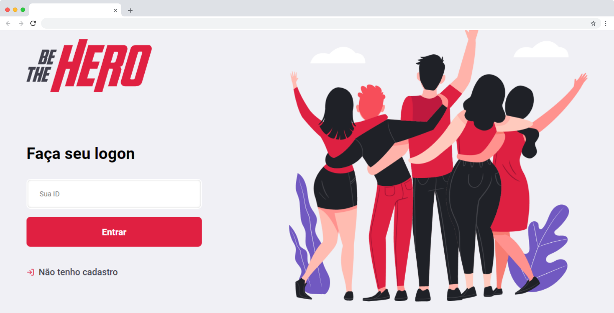

# Be The Hero

Apoie ONGs, apoie as boas causas, **be a hero!**

[](https://app.netlify.com/sites/be-thehero/deploys) 




## 💻 Demo

[https://be-thehero.netlify.com/](https://be-thehero.netlify.com/)

### 📱 App

[Download para Android](https://github.com/jeferson-sb/be-the-hero/releases/tag/1.0.0)

## 🚀 Quick start

### Installation

```bash
$ cd be-the-hero
$ cd frontend && yarn
```

```bash
$ cd .. && cd backend
$ yarn
```

### Usage

```bash
$ cd frontend
$ yarn start
```

> Abra outro terminal na mesma pasta e rode

```bash
$ cd backend
$ npx knex migrate:latest
$ yarn dev
```

## TODO

- [x] Criar release 1.0.0 do app
- [ ] Adicionar Styled Components
- [x] Adicionar mais testes
- [ ] Adicionar autenticação JWT
- [ ] Exibir total de apoiadores(heroes)
- [ ] Exibir o progresso do arrecadado.

## 📝 License

Este projeto está sob a licença [MIT](https://github.com/jeferson-sb/be-the-hero/blob/master/LICENSE.md)
